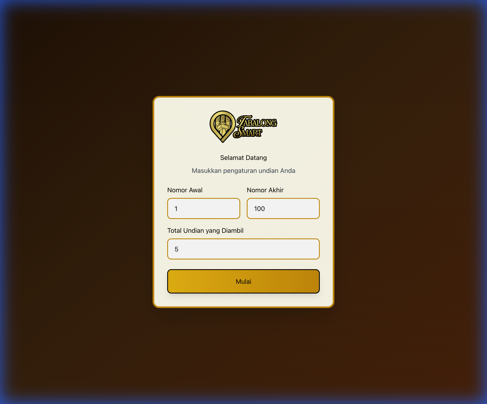
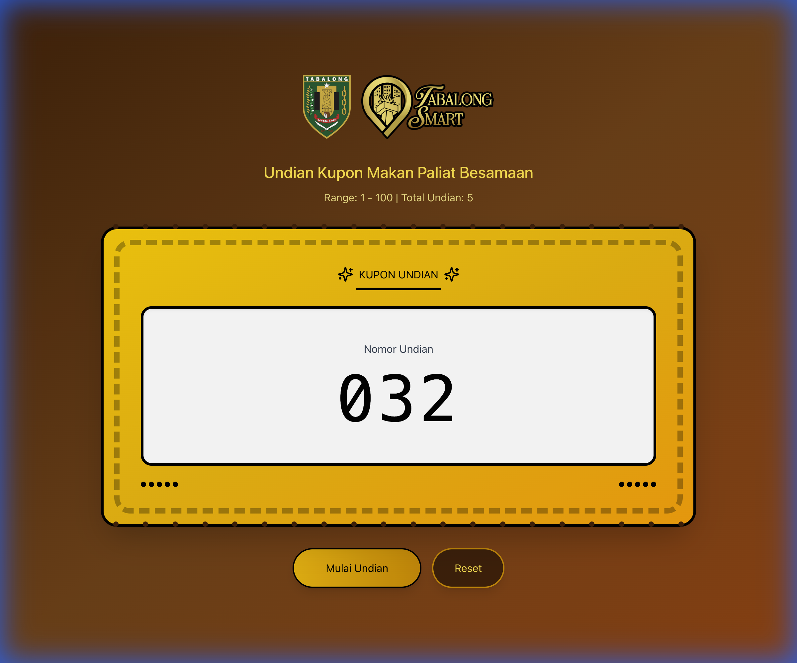

# Undian Web App

Aplikasi ini adalah aplikasi web untuk melakukan undian digital, khususnya untuk acara "Undian Kupon Makan Paliat Besamaan". Aplikasi ini memungkinkan panitia untuk mengundi nomor pemenang dari rentang nomor kupon yang telah ditentukan secara adil dan transparan.

## Fitur Utama

- **Kustomisasi Undian**: Pengguna dapat mengatur nomor awal, nomor akhir, dan total jumlah pemenang yang akan diundi.
- **Animasi Interaktif**: Tampilan animasi saat proses pengundian berlangsung untuk meningkatkan ketegangan dan keseruan.
- **Daftar Pemenang**: Menampilkan secara langsung nomor-nomor yang telah terpilih sebagai pemenang.
- **Daftar Pemenang**: Menampilkan secara langsung nomor-nomor yang telah terpilih sebagai pemenang.
- **Desain Responsif**: Antarmuka yang ramah pengguna dan responsif dengan nuansa tema Tabalong.

## Hotkeys

Aplikasi ini mendukung penggunaan keyboard untuk memudahkan operator:
- **Spasi**: Memulai undian (jika dialog tertutup dan sedang tidak mengundi).
- **R**: Mengundi ulang (menghanguskan nomor terakhir dan langsung mengundi nomor baru).
- **F**: Masuk/Keluar mode layar penuh (Fullscreen).

## Tampilan Aplikasi

Berikut adalah tangkapan layar dari aplikasi:

### Halaman Awal (Dialog)


### Halaman Utama


## Cara Menjalankan

Ikuti langkah-langkah berikut untuk menjalankan aplikasi di komputer lokal Anda:

1. **Instalasi Dependensi**
   Jalankan perintah berikut di terminal untuk mengunduh semua pustaka yang diperlukan:
   ```bash
   bun install
   ```

2. **Menjalankan Server Development**
   Setelah instalasi selesai, jalankan aplikasi dengan perintah:
   ```bash
   bun dev
   ```
   Buka tautan yang muncul di terminal (biasanya `http://localhost:5173`) untuk melihat aplikasi.

## Lisensi

Proyek ini dilisensikan di bawah [Lisensi MIT](LICENSE).